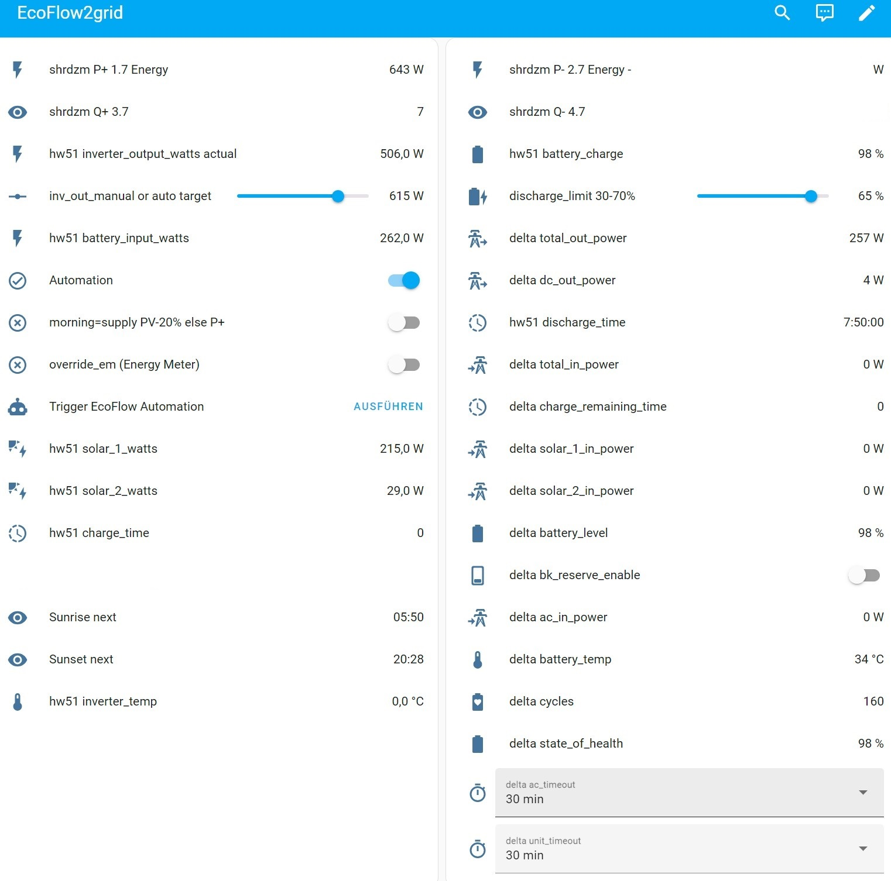

<h2>Manage EcoFlow PowerStream inverter and Delta battery 
with data from energy meter using HomeAssistant 
No Love-Marriage, but Successful</h2>

Tamed: hot-running PowerStream1) + Delta 2 Max2) + limited practicality app (eg energy meter integration still in development)3) + smart meter + mighty, complicated HA4)

<b>Manage PowerStream inverter_out_watts and Delta battery_charge with data from an energy meter (SHRDZM, Shelly Pro 3EM) using HA and the EcoFlow API, replacing a somewhat reality-detached app and SmartPlugs with compact, one-page browser dashboards on PC or mobile</b>

<b>IMPORTANT NOTE PER 20240823: In another "stroke of genius" EcoFlow made their mobile app prerequisite for read-outs via the API.</b> 
IOW: Since mid August a HomeAssistant (dashboard) will only get (e.g. Delta charge_level) data when you bring the mobile app into the foreground and select the device. 
Sorry to say: THIS OBLITERATES THE PYSCRIPT ALGO. If the capitalization sounds like annoyed shouting - it is.

<h3>Installation in HomeAssistant Supervised with HACS, EcoFlow Cloud and VS Code already in Place</h3>

Use VS Code HA integration and the HA file structure in Code > Explorer in sidebar: 
Merge the content of three files to possibly existing ones: secrets.yaml, configuration.yaml and automations.yaml 
<code>mkdir pyscript</code> in config (root that you see) and copy <code>set_ef.py</code> there. 
<b>See the instructions and comments in <code>pyscript/set_ef.py</code>,</b> about these essential files, how to use at least one of the provided dashboard files to check live values and set parameters and understand my PyScript's logic.

<b>With the HA non-Docker experience on PiOS I was totally reluctant to deal with it ever again, 
<em>but I'm STILL AWED BY THE VALUE that HA Supervised on HA OS on a Pi 4 4GB with HACS and VS Code integration brings! (Charts are a revelation!)</em></b> 
Would have never been able to uncover and prove the battery pack fault without it! (Shipped for repair per 20240813. Development suspended until return.)

<a href="https://github.com/svenerbe/ecoflow_dynamic_power_adjustment/">Sven's pyscript</a> was the first code I found working to change inverter_output_watts. 
Running on top of HomeAssistant initially looked like a huge burden, complicating things, but turned out vastly advantageous with many of HA's features. 

<h3>Version History</h3>

0.2.2 20240822 1420 Snr v Name conflicts quick fix after new Delta and PS re-add in HA 
0.2.0 20240817 1600: logging quick fix (hopefully &#128517; ) while waiting for battery repair 
0.1.8 20240810 1010: Initial <em>dump</em>

<h3>Real-World Info</h3>

I'm trying to present a simple, real-world solution for some average household. 
With our constellation we should consume the PV energy during the morning and only trickle-feed the battery. 
The battery quickly fills up on sunny days around noon (1.5h) and much surplus is wasted in the afternoon. After sunset it helps for a few hours. 
<b>The 2kWh are too little for us, but a nice thunderstorm-outage buffer and more storage in this class would hardly pay.</b> 
If my favourite (e-)car brand offered good home integration I would go for 10kWp today and use the car as a battery.

<b>One of the noteable differences to standard installations:</b> 
I have the <b>Delta 2 Max "overpaneled"</b>, i.e. 2 panels in parallel on each input. <b>With 2 additional panels on the PS, on a sunny day this is much more than the 800W that the PS can (ideally) output or the Delta 2 Max can take (1000W), but together they can (sort of) and on overcast days the PV delivers only 10+%, so overpaneling helps!</b> 
<b>Also worth mentioning: The Delta cuts off PV when fully charged</b> (doesn't pass on to the PS), <b>so we should use as much as we can in mornings.</b> 
With 800W normal average demand in evenings the D2M will not last long, but with 40% charge saved it is very convenient in case of an emergenciy.

<h3>Footnotes: The Good, the Bad and the Ugly</h3>

1) PowerStream 
With the release of some vent kit they say what I suspected for some time: 
If ambient temperature is above normal room temperature, the PS maxes out around 500 to 600 watts. (instead of 800W allowed) 
Seems the metal sheet profile spacer (primitive heatsink) that I put between Delta and PS didn't help wattage much, but at least it doesn't lose WiFi connection any more when hot.

2) Delta 2 Max 
The Delta WiFi bug (no reconnect after standby) is extremely annoying, because one must disconnect PV and PS to restart it. 
For many months this was exacerbated by a faulty battery pack in my Delta (due for repair) which sent it into standby during the night, when it had predicted to have enough charge till next afternoon. (One problem at a time would be too easy to detect!)

3) app (on my iPhone) 
In the app, even without buggy features and flakyness, some interdependencies would be hard to understand. 
Only after intensive interaction with the app and comparison with PyScript results and HA charts I understood some "features": 
E.g.: The Delta cuts off PV when full. OTOH you can set the PS to "donate" surplus to the grid. (Settings > Household power demand > Feed-in control) 
Smart meter integration (Shelly 3EM) is still in development and Smart Plugs are a half-baked solution. (How do you integrate an energy hog like an electric kitchen stove?)

4) HomeAssistant 
The only working HomeAssistent solution is HA Supervised on HA Operating System or Docker on PiOS on a Raspi 3 (or similar) or better or a virtual machine (ready-to-run image). The VM is much faster with file ops. 
<b>On a Pi 4 4GB ops are fast</b> (also VS Code) like on a good smart phone, except many-file-ops that depend on the SD-card. 
Do not waste your time with non-Supervised on PiOS, e.g., getting into an endless HA - Python update spiral! 
The HA's charts seem like a great tool to dig into optimizing photovoltaic usage or uncover battery or app deficiencies.

5) I still need to find out what causes the Delta unit_timeout to change from Never to 30 min. Until then the Delta Automation runs every 20 mins and switches it back to Never.

6) Some features in the supplied dashboard YAML files are not supported in the normal built-in editor and for sure not in the visual one. 
The private part of entity names must be edited manually, so the only choice is to Add Dashboard, Edit, ... RAW Configuration Editor, paste the YAML code and replace entity placeholders with actual name parts. 
(While using Jinja2 templating for secrets is possible, the actual implementation gets pretty complicated quickly, especially together with other dashboard tricks, so this is the kludge I must recommend for now!)

<h2>Disclaimer as usual</h2>

You may use the info and run the code in this repo at your own risk. 
I'm not affiliated with any company named. 
I'm expressing my opinions based on personal experiences without any commercial interest whatsoever.

 

<h3>Dashboard EcoFlow 2-col</h3>

- shrdzm energy consumed; P- and Q- not yet understood completely and hidden 
- Delta battery charge % from cable-connected PowerStream; still available when Delta is offline due to WiFi reconnect-after-standby-bug 
- inverter_output_watts actual: See code for several target-to-actual differences due to limitations (eg PS heat throttling,..) and logic (eg charge < discharge_limit,..) 
- inv_out_manual or auto target: if Automation is on, the calculated demand is fed back here; else set desired output manually with the slider after switching off Automation 
- discharge_limit according to requirements like normal day or backup for imminent thunderstorm 
- battery_input_watts fed to PS in addition to PV 
- Automation v manual target output for PS; to dis/enable the PyScript: Settings > Automations  
- override_em: Override energy meter with inv_out_manual if logic allows (eg discharge_limit) 
- Trigger EcoFlow Automation when disabled or in addition to minute-cycle 
- hw51 charge_time = delta charge_remaining_time 

 

